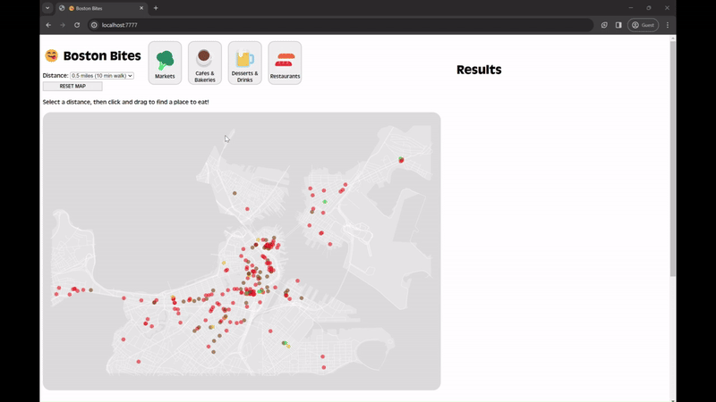

# [Boston Bites](https://gitstelle.github.io/info4310-restaurant-finder/)

This was a group project authored by Estelle Hooper, Eva Ruse, and Gaby Chu for INFO 4310: Interactive Information Visualization in spring 2023. We were prompted to "interactive visualization which helps consumers to make decisions about a dataset."

## Table of Contents

- [Boston Bites](#boston-bites)
  - [Table of Contents](#table-of-contents)
  - [Overview](#overview)
    - [Techniques](#techniques)
    - [Data](#data)
  - [Acknowledgements/References](#acknowledgementsreferences)
  - [License](#license)

## Overview

Boston Bites is a tool meant for users that want to find a place to eat in the Boston metropolitan area by providing a way to explore establishments spatially on a map as well as providing information like rating and address for specific places.

You can access our project [here!](https://gitstelle.github.io/info4310-restaurant-finder/)

### Techniques
HTML, CSS, JavaScript (d3.js), pan and zoom, brush, python (data cleaning)

### Data
[(Back to top)](#table-of-contents)

- `yelp_boston.csv` provided by course instructor. Dataset includes restaurant name, labels, address, rating, and link to the yelp page.

- `boston_clean.csv` preprocessed version of `yelp_boston.csv` hand-picking on main button filter categories and secondary checkbox filter categories

- [Boston Street Segments geojson](https://data.boston.gov/dataset/boston-street-segments)
- [City of Boston Boundary geojson](https://data.boston.gov/dataset/city-of-boston-boundary)
- [Boston neighborhoods geojson](https://bostonopendata-boston.opendata.arcgis.com/datasets/3525b0ee6e6b427f9aab5d0a1d0a1a28/explore?location=42.312358%2C-71.056800%2C12.77)

## Acknowledgements/References
[(Back to top)](#table-of-contents)

- [Mapshaper](https://mapshaper.org/)
- [Brush documentation](https://d3-graph-gallery.com/graph/interactivity_brush.html)
- [HTML checkboxes documentation](https://developer.mozilla.org/en-US/docs/Web/HTML/Element/input/checkbox) with a [data join](https://stackoverflow.com/questions/52598074/d3-checkbox-label-input-order)

Thank you to Professor Rzeszotarski and the INFO 4310 course staff!

## License
[(Back to top)](#table-of-contents)

[MIT License](https://opensource.org/license/mit/)